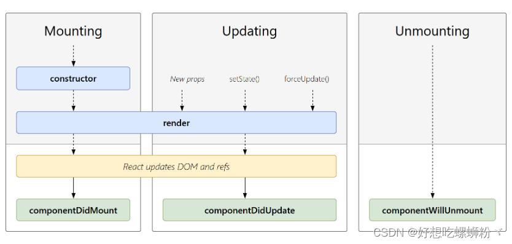

# React 组件生命周期
组件的生命周期可分成三个状态：
 - Mounting(挂载)：已插入真实 DOM 
 - Updating(更新)：正在被重新渲染 
 - Unmounting(卸载)：已移出真实 DOM
 

## 挂载
当组件实例被创建并插入 DOM 中时，其生命周期调用顺序如下：
- constructor(): 在 React 组件挂载之前，会调用它的构造函数。
- getDerivedStateFromProps(): 在调用 render 方法之前调用，并且在初始挂载及后续更新时都会被调用。
- render(): render() 方法是 class 组件中唯一必须实现的方法。
- componentDidMount(): 在组件挂载后（插入 DOM 树中）立即调用
> render() 方法是 class 组件中唯一必须实现的方法，其他方法可以根据自己的需要来实现。

## 更新
每当组件的 state 或 props 发生变化时，组件就会更新。

当组件的 props 或 state 发生变化时会触发更新。组件更新的生命周期调用顺序如下：
- getDerivedStateFromProps(): 在调用 render 方法之前调用，并且在初始挂载及后续更新时都会被调用。根据 shouldComponentUpdate() 的返回值，判断 React 组件的输出是否受当前 state 或 props 更改的影响。
- shouldComponentUpdate():当 props 或 state 发生变化时，shouldComponentUpdate() 会在渲染执行之前被调用。
- render(): render() 方法是 class 组件中唯一必须实现的方法。
- getSnapshotBeforeUpdate(): 在最近一次渲染输出（提交到 DOM 节点）之前调用。
- componentDidUpdate(): 在更新后会被立即调用。
>render() 方法是 class 组件中唯一必须实现的方法，其他方法可以根据自己的需要来实现。

## 卸载
当组件从 DOM 中移除时会调用如下方法：
- componentWillUnmount(): 在组件卸载及销毁之前直接调用。